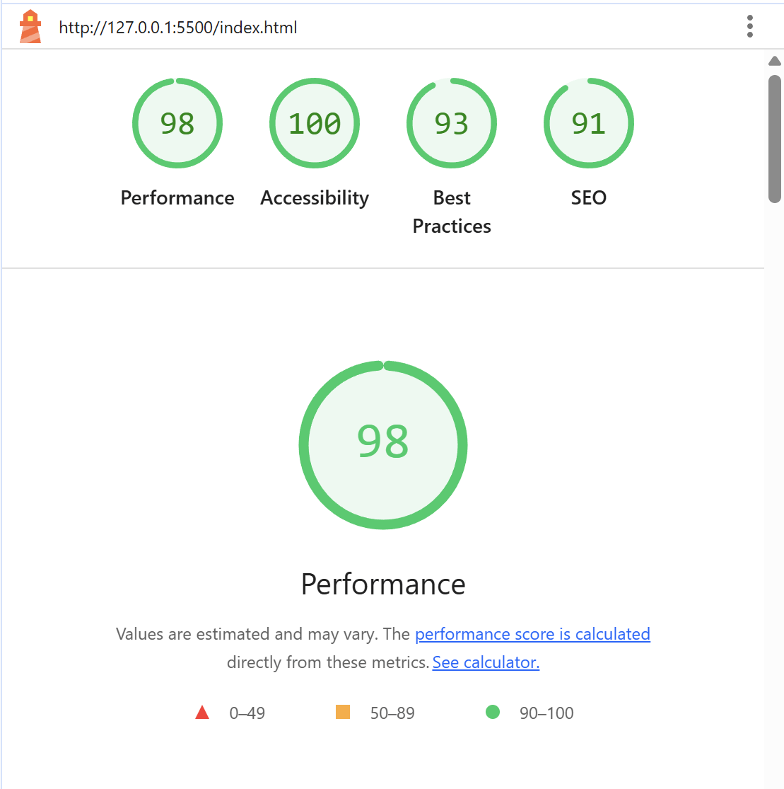
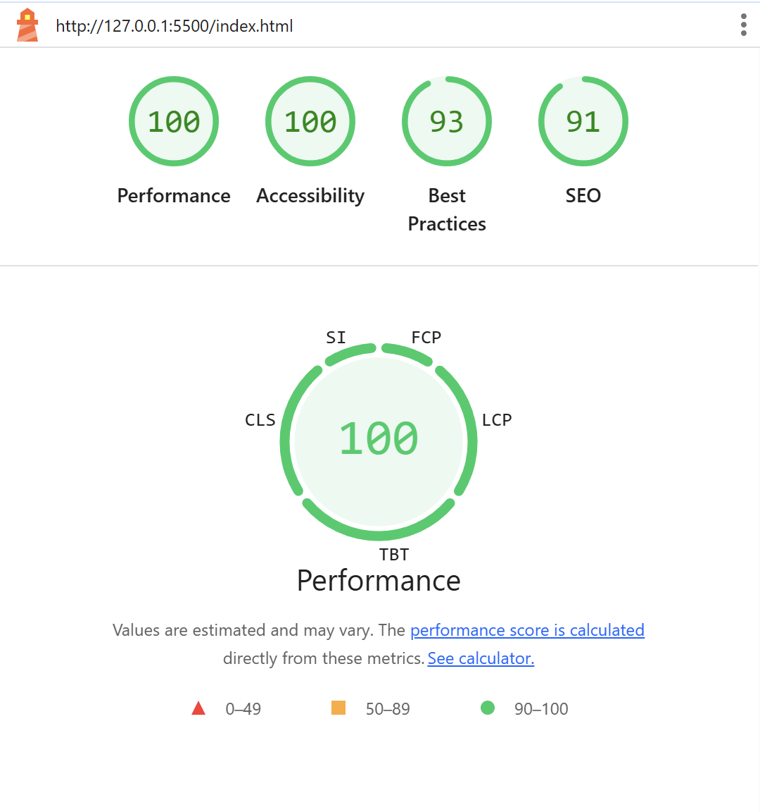

# Assignment 3 – Personal Portfolio

## Overview

This is an updated personal website built for a web development course (Assignment 3).  
The assignment focuses on integrating dynamic content, interactive features, 
and enhancing web development skills using HTML, CSS, and JavaScript.  
The website is responsive, includes animations, and fetches data dynamically from GitHub.

---

## Objectives

- Practice **HTML, CSS, and JavaScript** basics  
- Implement **dynamic content fetching** from GitHub API  
- Apply **responsive** design principles  
- Add interactive features like **theme toggle, personalized greeting, and animations**

---

## Features

- **Home section** with a welcome message and personalized greeting based on time of day  
- **Projects section** showcasing academic projects  
- **GitHub Repositories section -API Integration-** dynamically displaying latest 5 repos from GitHub  
- **Contact section** with a functional contact form and validation  
- **Light/Dark mode toggle** with rotating icon and LocalStorage support  
- **Animations / Transitions** including fade-in sections and hover effects for buttons, images, and project cards  
- **Testing using Lighthouse** 
Before >> 
After >> 

---

## Technologies Used

- **HTML** structure for all sections and elements  
- **CSS** styling, responsive layout, themes, and animations  
- **JavaScript** for interactivity, theme toggle, personalized greeting, fade-in animations, and dynamic GitHub data fetching  
- **GitHub API** to dynamically load latest repositories 
- **Lighthouse** to test the performance  

---

## Project Structure
assignment-3/
├── README.md
├── index.html
├── css/
│   └── styles.css
├── js/
│   └── script.js
├── assets/
│   └── images/
└── .gitignore

---

## Live Demo
[View the live portfolio](https://fatimasaad2003s.github.io/assignment-3/)

---

## How To Run 

- Download this repository as a ZIP file  
- Open the project folder in a code editor or IDE  
- Clone the Git repository (optional)  
- Open `index.html` in a browser (Chrome, Edge, Firefox, etc.)  
- Test all features interactively (theme toggle, greeting, GitHub repos, animations, contact form)

---

## Author

**Fatima Saad** – Bachelor’s student in Computer Science at KFUPM
